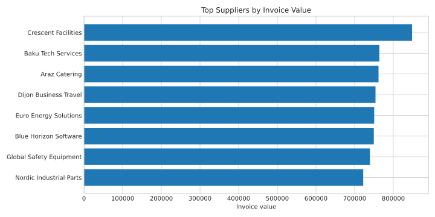
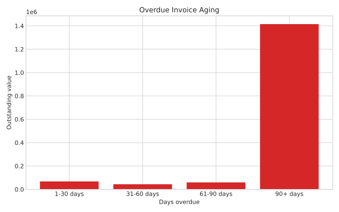

# Accounts Payable & Invoice Analytics

A finance analytics project that reviews invoice processing, payment performance, overdue exposure, and supplier spend. The dataset is synthetic and is included to demonstrate the analysis workflow without using confidential company information.

## Business questions

- How much invoice value is overdue or still outstanding?
- Which departments and suppliers create the largest payment exposure?
- How long does payment take on average?
- Where do duplicate invoice risks appear?
- Which suppliers have the highest late-payment rates?

## Project structure

```text
accounts-payable-analytics/
├── data/
│   ├── sample/              # Small dataset for quick inspection
│   ├── raw/                 # Generated invoice records, not tracked
│   └── processed/           # Clean analysis-ready dataset
├── outputs/
│   ├── charts/              # Dashboard charts
│   └── tables/              # KPI and analytical extracts
├── sql/                     # SQL analysis queries
├── src/                     # Data generation and analysis scripts
├── requirements.txt
└── README.md
```

## Main KPIs

The scripts produce the following measures:

- Total invoices and invoice value
- Paid, outstanding, and overdue value
- Average payment days
- Late payment rate
- Duplicate invoice candidates
- Invoice aging by overdue days
- Supplier and department spend

## Results from the included run

| KPI | Result |
| --- | ---: |
| Total invoices | 5,035 |
| Total invoice value | 8.85M |
| Outstanding value | 1.60M |
| Overdue value | 1.59M |
| Average payment days | 45.9 |
| Late-payment rate | 68.4% |
| Duplicate candidates | 70 |





## How to run

```bash
python -m venv .venv
source .venv/bin/activate
pip install -r requirements.txt

python src/generate_data.py
python src/analyze_invoices.py
```

Run the scripts from the repository root. The first script creates a reproducible sample of 5,000 invoices. The second script cleans the data, calculates KPIs, writes tables, and creates charts.

## Method

1. Validate dates, currencies, invoice values, and payment status.
2. Calculate payment days for paid invoices.
3. Classify outstanding invoices into aging buckets.
4. Flag potential duplicates using supplier, invoice amount, PO number, and close invoice dates.
5. Aggregate the results by supplier, department, country, and payment status.

## Findings

Run `src/analyze_invoices.py` to refresh `outputs/tables/kpi_summary.csv` and the dashboard visuals. The synthetic data is deterministic, so the same results are reproduced on each run.

## Tools

- Python: pandas, matplotlib
- SQL: PostgreSQL-compatible queries
- Power BI: the exported tables are ready to load into a dashboard

## Notes

This project uses synthetic data only. It does not include any company invoices, supplier records, or sensitive financial data.
